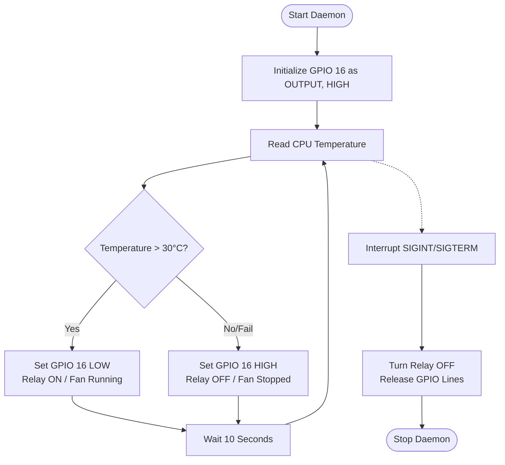

# ❄️ Cooling Relay Controller

<p align="center">
  
  
</p>

## 📌 Overview

The **Cooling Relay Controller** is a dedicated thermal safety daemon running on the Raspberry Pi 5 core. It dynamically monitors CPU temperature using multiple sensing interfaces and controls an active-low relay pin (`GPIO 16`) connected to the buoy's cooling fan assembly. This prevents thermal throttling and hardware damage in sealed, hot marine environments.

---

## ⚙️ How It Works & Logic Flow

The module implements a continuous monitoring daemon loop that checks temperatures at regular intervals.



### 1. Temperature Sensing Algorithm
To maximize reliability, the controller checks temperature via two redundant methods:
1. **Primary Method (`vcgencmd`)**: Calls the Raspberry Pi system utility `vcgencmd measure_temp` to get the GPU/CPU core temperature directly.
2. **Fallback Method (`sysfs`)**: If `vcgencmd` is unavailable (e.g., in virtualized or non-Raspberry Pi Linux environments), it reads directly from the Linux kernel thermal sysfs interface: `/sys/class/thermal/thermal_zone0/temp`.

### 2. Active-Low Relay Logic
The relay board operates on **active-low logic**. This means pulling the GPIO line to ground (`LOW`) completes the control loop to turn the fan **ON**, while driving the GPIO line to `HIGH` opens the loop to turn it **OFF**.

| Hardware State | Intent | GPIO Voltage Level | `gpiod` Value |
| :--- | :--- | :--- | :--- |
| **Relay ON (Active)** | Turn on cooling fan | `0V` (LOW) | `Value.INACTIVE` |
| **Relay OFF (Inactive)** | Turn off cooling fan | `3.3V` (HIGH) | `Value.ACTIVE` |

> [!IMPORTANT]
> The default power-up state of the GPIO pins on a Raspberry Pi is high-impedance/pull-up. Because active-low relays trigger on ground, the script configures the initial line request value as `Value.ACTIVE` (`HIGH`) to keep the fan OFF during boot, avoiding unnecessary startup surge.
> If the temperature reading fails, the script defaults to **Relay OFF** for electrical safety.

---

## 🔬 Mathematical Representation

The system executes a simple step-function threshold control:

$$R_{\text{state}}(T) = \begin{cases} \text{ON} \ (\text{GPIO LOW}) & \text{if } T > T_{\text{threshold}} \\ \text{OFF} \ (\text{GPIO HIGH}) & \text{if } T \le T_{\text{threshold}} \lor T = \emptyset \end{cases}$$

Where:
*   \(T\) is the current CPU temperature in Celsius.
*   \(T_{\text{threshold}}\) is set to \(30.0^\circ\text{C}\).
*   \(\emptyset\) represents a read error or failed check.

---

## 📂 Source Code Map
*   **[cooling_relay.py](file:///c:/Users/Ervin%20Regio/Desktop/MACOSX/FISHTRACK-BUOY/COOLING_RELAY/cooling_relay.py)**: Main daemon file utilizing `gpiod` for modern Linux GPIO handling.

---

## 🚀 Running the Controller

Ensure `gpiod` bindings are installed:
```bash
pip install gpiod
```

Run as a background service:
```bash
python COOLING_RELAY/cooling_relay.py
```
