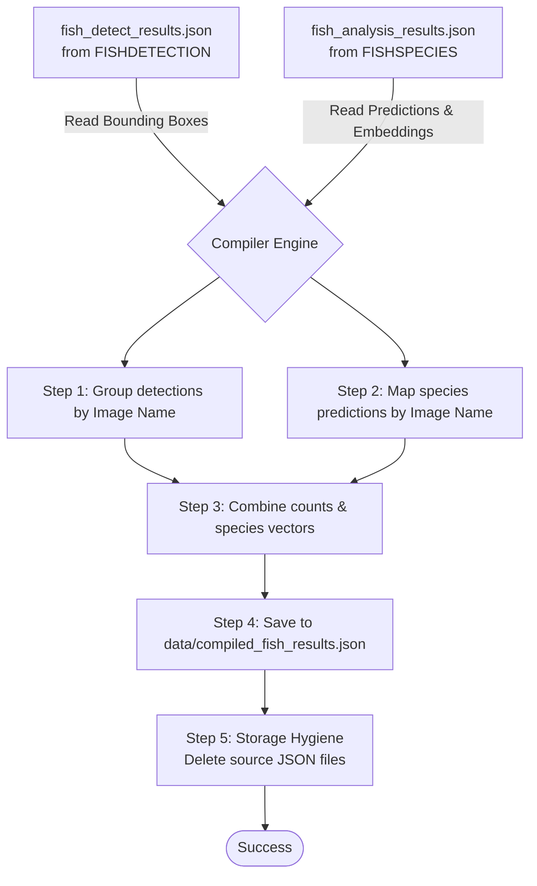

# 🔄 Fish Results Compiler

<p align="center">
  
  
</p>

## 📌 Overview

The **Fish Results Compiler** is the final data-aggregation layer of the FishTrack computer vision pipeline. It coordinates files from the detection subsystem (`FISHDETECTION`) and the species classification subsystem (`FISHSPECIES`). It maps object coordinates, timestamps, and classifications together, outputs a single consolidated database payload, and performs file hygiene.

---

## ⚙️ Data Flow & Logic

The compiler aggregates spatial and taxonomic outputs through a synchronized merge pipeline:



### 1. Count Aggregation
The script scans all bounding boxes in `fish_detect_results.json`. For each image name, it increments a counter and captures the earliest bounding-box timestamp:

$$\text{Count}(I) = \sum_{j \in \text{detections}} [I_j = I]$$

### 2. Species Mapping
It indexes the species data in `fish_analysis_results.json` by image filename, extracting lists of:
*   **Species Name** (Scientific taxonomy)
*   **Confidence Score** (Overall combined model probability)
*   **Direct Score** (Logit-based output from the ArcFace head)
*   **Retrieval Score** (Distance-based similarity from the FAISS database)

### 3. Cleanup Routine
To prevent high storage churn and duplicate processing on a resource-constrained Raspberry Pi, the compiler safely deletes the temporary source files `fish_detect_results.json` and `fish_analysis_results.json` immediately upon successful write.

> [!WARNING]
> Because input files are deleted after execution, this script should only be run after both detection and classification cycles have finished. Running it prematurely will result in incomplete datasets and loss of raw bounding-box listings.

---

## 📊 Consolidated Data Schema

The consolidated output saved in `data/compiled_fish_results.json` follows this schema:

```json
[
  {
    "Image Name": "19_02_2026_19_55_48_crop_0.png",
    "Timestamp": "19/02/2026 19:55",
    "Fish Detected": 1,
    "Species Detected": [
      {
        "species": "Bagre marinus",
        "confidence": 0.7153,
        "direct_score": 0.6382,
        "retrieval_score": 0.7924
      }
    ]
  }
]
```

---

## 📂 Source Code Map
*   **[fish_compile_results.py](file:///c:/Users/Ervin%20Regio/Desktop/MACOSX/FISHTRACK-BUOY/FISHCOMPILE/fish_compile_results.py)**: Orchestration script.
*   **data/**: Target output directory for the compiled results.

---

## 🚀 Running the Compiler

Run the merge pipeline manually:
```bash
python FISHCOMPILE/fish_compile_results.py
```
