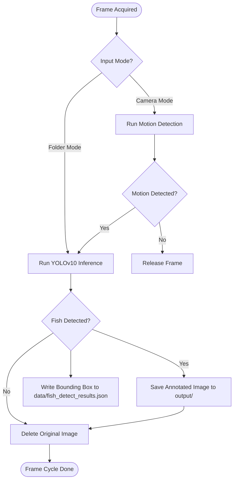

# 🔍 Fish Detection Subsystem

<p align="center">
  
  
  
</p>

## 📌 Overview

The **Fish Detection Subsystem** runs local computer vision algorithms on the buoy. It uses custom motion filtering, real-time object detection via a TorchScript-compiled **YOLOv10** model, and autonomous nighttime illumination control. The system triggers captures, outlines bounding boxes around target fish, and routes metadata to the compilation engine.

---

## ⚙️ Logic Architecture & Workflows

The subsystem operates an optimized frame processing loop that keeps hardware overhead low:



### 1. Motion Filtering Algorithm
Before running heavy deep learning models, the system runs an OpenCV-based frame difference filter:
*   Convert frame to Grayscale and apply Gaussian Blur (\(21 \times 21\) kernel) to reduce camera sensor noise.
*   Compute absolute difference between the current frame and the previous background frame.
*   Apply thresholding (\(\text{sensitivity} = 25\)) and dilate the binary mask.
*   Find contours; if any contour exceeds `min_area` (\(500 \text{ px}^2\)), motion is flagged, triggering YOLO inference.

### 2. Nighttime IR Illumination Control (Active-Low)
The system checks the local clock. If the current hour is between `18:00` (6 PM) and `06:00` (6 AM), the script activates the underwater Infrared (IR) spotlight array by pulling `GPIO 17` LOW.

| System Time | Target IR Relay State | GPIO Pin State |
| :--- | :--- | :--- |
| **Daytime (06:00 - 17:59)** | OFF (Inactive) | `3.3V` (HIGH) |
| **Nighttime (18:00 - 05:59)** | ON (Active) | `0V` (LOW) |

> [!NOTE]
> The module is compatible with multiple GPIO backends:
> *   **gpiod v2.x (Modern Pi 5)**: Requests lines using `/dev/gpiochipX`.
> *   **gpiod v1.x (Legacy Pi 4/5)**: Utilizes traditional chip binding.
> *   **RPi.GPIO**: Legacy fallback interface.

---

## 🔬 Mathematical Formulas

### Image Thresholding
$$\text{Threshold}(x,y) = \begin{cases} 255 & \text{if } |I_{\text{current}}(x,y) - I_{\text{prev}}(x,y)| > \theta_{\text{sens}} \\ 0 & \text{otherwise} \end{cases}$$

### Post-Processing Scale
To map bounding boxes from the model size (\(640 \times 640\)) back to original image dimensions:

$$X_{\text{orig}} = X_{\text{model}} \cdot \frac{W_{\text{orig}}}{640}, \quad Y_{\text{orig}} = Y_{\text{model}} \cdot \frac{H_{\text{orig}}}{640}$$

---

## 📂 Source Code Map
*   **[[LINUX] fishdetect.py](file:///c:/Users/Ervin%20Regio/Desktop/MACOSX/FISHTRACK-BUOY/FISHDETECTION/%5BLINUX%5D%20fishdetect.py)**: Linux script supporting Picamera2, `gpiod` v1/v2, and directory scanning.
*   **[[WINDOW] fishdetect.py](file:///c:/Users/Ervin%20Regio/Desktop/MACOSX/FISHTRACK-BUOY/FISHDETECTION/%5BWINDOW%5D%20fishdetect.py)**: Windows version using `cv2.VideoCapture`.
*   **model.ts**: Pre-compiled YOLOv10 TorchScript model file.
*   **labels.json**: Target labels index.

---

## 🚀 Execution Commands

### Linux Execution (with live camera & relay)
```bash
python "FISHDETECTION/[LINUX] fishdetect.py" --model model.ts --labels labels.json --motion-threshold 5000
```

### Folder Parsing (Process existing files)
```bash
python "FISHDETECTION/[LINUX] fishdetect.py" --model model.ts --labels labels.json --input-folder captures/
```
