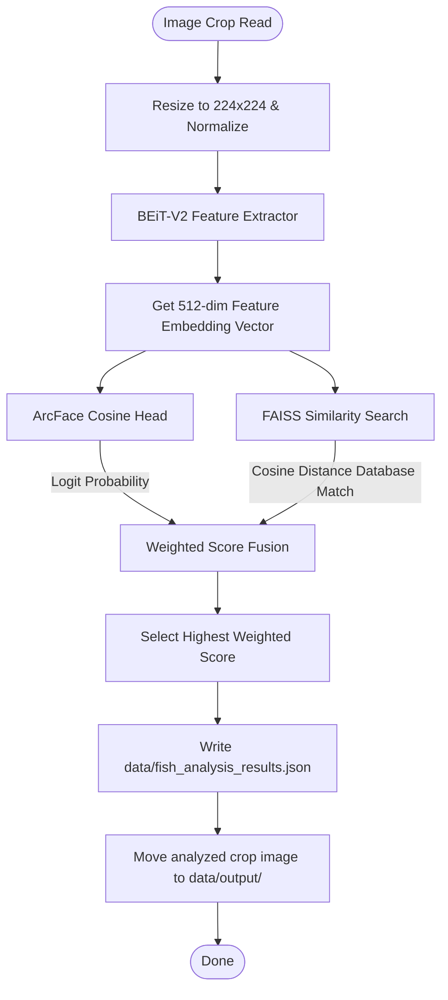

# 🐟 Fish Species Classifier

<p align="center">
  
  
  
</p>

## 📌 Overview

The **Fish Species Classifier** is a hybrid taxonomic identification engine. It uses a **BEiT-V2** vision transformer backbone combined with an **ArcFace** head, and pairs this with a **FAISS** (Facebook AI Similarity Search) nearest-neighbor retrieval database. This hybrid approach enables highly accurate classifications of underwater targets.

---

## ⚙️ How It Works & Scoring Logic

The classification pipeline uses a dual-path classification model combined with vector search:



### 1. Direct Classification (ArcFace Logits)
The model head maps the normalized feature vector \(\mathbf{f}\) to the normalized weight matrix \(\mathbf{W}\) of species classes using angular distance scoring:

$$\text{logits} = s \cdot \frac{\mathbf{f} \cdot \mathbf{W}_i}{\|\mathbf{f}\| \|\mathbf{W}_i\|} = s \cdot \cos(\theta_i)$$

Where:
*   \(s\) is the scaling factor (configured to \(30.0\)).
*   \(\theta_i\) is the angle between the embedding vector and the class weight vector.

### 2. Retrieval-Based Search (FAISS)
The image embedding vector is matched against pre-computed species reference vectors in a FAISS index (`database.pt`). Similarity is measured using cosine distance:

$$\text{Sim}_{\text{retrieval}} = \frac{\mathbf{f} \cdot \mathbf{v}_{\text{db}}}{\|\mathbf{f}\| \|\mathbf{v}_{\text{db}}\|} = \cos(\phi)$$

### 3. Weighted Fusion
The model outputs final predictions by averaging the two scores:

$$\text{Score}_{\text{final}} = w_{\text{direct}} \cdot P_{\text{direct}} + w_{\text{retrieval}} \cdot \text{Sim}_{\text{retrieval}}$$

Where weights are balanced at \(w_{\text{direct}} = 0.5\) and \(w_{\text{retrieval}} = 0.5\).

---

## 📂 Source Code Map
*   **[fish_species_detect.py](file:///c:/Users/Ervin%20Regio/Desktop/MACOSX/FISHTRACK-BUOY/FISHSPECIES/fish_species_detect.py)**: Main hybrid classification logic script.
*   **database.pt**: PyTorch binary file holding reference vector embeddings.
*   **model.ckpt**: Deep learning classifier model checkpoint.
*   **labels.json**: Class index mapping.

---

## 🚀 Running the Classifier

Ensure PyTorch, `faiss-cpu` (or `faiss-gpu`), and `timm` are installed:
```bash
pip install torch torchvision timm faiss-cpu
```

Run classification on detected images:
```bash
python FISHSPECIES/fish_species_detect.py
```
