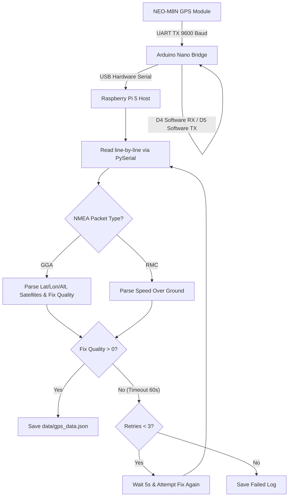

# 🌐 GPS Bridge & Parser Subsystem

<p align="center">
  
  
  
</p>

## 📌 Overview

The **GPS Subsystem** coordinates satellite positioning telemetry on the buoy. It uses a **NEO-M8N** GPS module connected to an **Arduino Nano** microcontroller, which acts as a UART-to-USB serial bridge. On the host Raspberry Pi 5 core, a Python utility listens to this stream, parses standard NMEA packets, extracts position coordinates, and writes updates to the telemetry registry.

---

## ⚙️ Hardware & Software Flow



### 1. Arduino Nano UART-to-USB Bridge
Because the hardware serial port of the Nano is shared with the USB bootloader, the firmware uses `SoftwareSerial` on pin `D4` (RX) and `D5` (TX) to interface with the GPS module. It reads raw bytes, forwards them directly to the USB interface (`Serial.write`), and blinks the built-in status LED (`D13`) to indicate activity.

### 2. NMEA Parsing & Conversion
The Pi parser filter handles two key NMEA sentences:
1.  **\$GPGGA (Global Positioning System Fix Data)**:
    *   **Latitude/Longitude**: Extracted and converted to decimal format.
    *   **Altitude**: Height above mean sea level.
    *   **Fix Quality**: 0 = Invalid, 1 = GPS Fix, 2 = DGPS Fix.
2.  **\$GPRMC (Recommended Minimum Navigation Information)**:
    *   **Speed Over Ground**: Decoded in knots and converted to kilometers per hour:

$$\text{Speed (km/h)} = \text{Speed (knots)} \times 1.852$$

### 3. Timeout and Retry Hysteresis
If the buoy starts up inside a shipping container or in heavy weather, satellite lock may be delayed. The reader attempts to poll for a fix for up to `60 seconds` per attempt, retrying up to `3 times` with a `5-second` cooldown delay between runs before outputting a failure status.

---

## 📂 Source Code Map
*   **[linux_gps_reader.py](file:///c:/Users/Ervin%20Regio/Desktop/MACOSX/FISHTRACK-BUOY/GPS_MODULE/linux_gps_reader.py)**: Python GPS NMEA parsing daemon.
*   **[gps_arduino/main.ino](file:///c:/Users/Ervin%20Regio/Desktop/MACOSX/FISHTRACK-BUOY/GPS_MODULE/gps_arduino/main.ino)**: Arduino Nano software bridge firmware.

---

## 🚀 Execution & Setup

### Upload Firmware
Compile and upload `gps_arduino/main.ino` to the Arduino Nano using the Arduino IDE or CLI.

### Run Parser
Ensure NMEA libraries are installed:
```bash
pip install pyserial pynmea2
```

Run the parser on the host:
```bash
python GPS_MODULE/linux_gps_reader.py /dev/ttyUSB0
```
