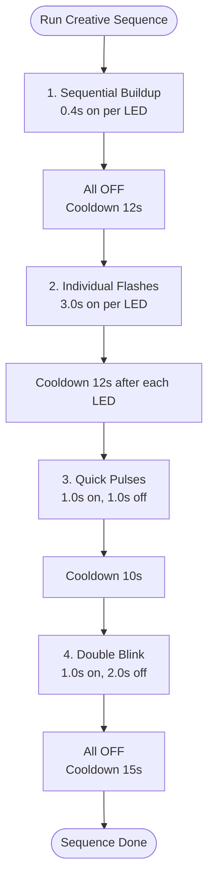

# 🚨 LED Wayfinder & Relay Bridge

<p align="center">
  
  
  
</p>

## 📌 Overview

The **LED Wayfinder** is a signaling and visual recovery beacon system. It uses an **Arduino Nano** microcontroller driving a 4-channel active-LOW relay board that switches four high-power 3W signaling lights (Red, Green, Yellow, Blue). The system features serial API command parsing and a strict **thermal management protocol** to prevent overheating.

---

## ⚙️ Hardware Interface & Command Set

The relay driver uses **active-LOW** logic, where pulling a channel's control pin to ground (`LOW`) activates the relay (turning the LED ON).

| LED Channel | Relays Pin | USB Command (ON) | USB Command (OFF) |
| :--- | :---: | :---: | :---: |
| 🔴 **Red Light** (IN3) | `Pin 2` | `R1` | `R0` |
| 🟢 **Green Light** (IN2) | `Pin 3` | `G1` | `G0` |
| 🟡 **Yellow Light** (IN4) | `Pin 4` | `Y1` | `Y0` |
| 🔵 **Blue Light** (IN1) | `Pin 5` | `B1` | `B0` |
| 🌈 **All Channels** | Multi-Pin | `ALL1` | `ALL0` |

### Status Query
Send `STATUS` via serial to query the relay registers:
```text
Red:ON Green:OFF Yellow:OFF Blue:ON
```

---

## 🛡️ Thermal Management & Safety Logic

High-power 3W LEDs generate significant heat. In the buoy's sealed waterproof dome, they lack passive air cooling. To prevent emitter failure, the system utilizes a **duty cycle pattern** managed by the host controller (`hardware.py`):



### Nighttime Loop Hysteresis
To further protect the LEDs and conserve battery power, the system runs the Wayfinder signaling sequence only at night:

$$S_{\text{trigger}}(t) = \begin{cases} \text{Active} & \text{if } t_{\text{hour}} \ge 18 \lor t_{\text{hour}} < 6 \text{ and } \Delta t \ge 900\text{s} \\ \text{Sleep} & \text{otherwise} \end{cases}$$

Where \(\Delta t\) represents the 15-minute cooldown interval between sequences.

---

## 📂 Source Code Map
*   **[arduino_relay_bridge/arduino_relay_bridge.ino](file:///c:/Users/Ervin%20Regio/Desktop/MACOSX/FISHTRACK-BUOY/LED_WAYFINDER/arduino_relay_bridge/arduino_relay_bridge.ino)**: Arduino microcontroller relay code.
*   **PCB_PCB-LED-DRIVER_2025-12-29.svg**: Custom PCB schematic layouts.

---

## 🚀 Upload & Execution

### Upload Firmware
Flash `arduino_relay_bridge.ino` to the Arduino Nano board using the Arduino IDE.

### Serial Commands Test
Open a serial terminal at `9600 Baud` and test control strings:
```bash
# Turn all lights on
ALL1
# Read relay status
STATUS
# Turn red off
R0
```
