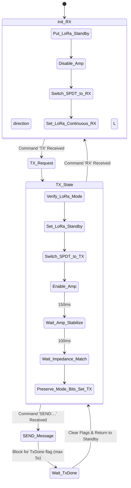

# 📡 LoRa USB Bus & RF Power Amplifier Bridge

  
  
  

## 📌 Overview

The **LoRa USB Bus** module manages long-range communication. Running on a Raspberry Pi Pico (YD-RP2040) in MicroPython, it bridges the host's USB serial connection with an **Adafruit RFM95W** LoRa transceiver (SX1276) and an external **4W RF Power Amplifier**. It enforces strict half-duplex operation, register-level PA configuration, and impedance stabilization routines to achieve multi-mile transmission ranges.

---

## ⚙️ RF Switch & Amplifier Control Logic

To protect the receiver circuitry from the high-power output of the 4W amplifier, the Pico controls an RF Single-Pole Double-Throw (SPDT) switch and a power relay:

*   `SPDT_EN` (Pin 10): Master enable for the RF switch (Active-LOW: `0` = ON, `1` = OFF/Isolated).
*   `SPDT_CTRL` (Pin 11): Routes the RF signal path (LOW `0` = TX Path to Amp Input; HIGH `1` = RX Path/Bypass).
*   `RELAY_IN1` (Pin 12): Toggles power to the 4W Power Amplifier (Active-LOW: `0` = Amp ON, `1` = Amp OFF).

---

## 🛠️ Register Configurations (SX1276)

To drive the external 4W RF power amplifier, the internal output power of the RFM95W transceiver must be boosted using register adjustments. This resolved the root cause of historical `TX_TIMEOUT` failures:

| Register Address | Register Name | Hex Value | Purpose |
| :--- | :--- | :---: | :--- |
| **`0x09`** | `RegPaConfig` | `0xFF` | Selects `PA_BOOST` pin, max power, output power = +20dBm. |
| **`0x0B`** | `RegOcp` | `0x3B` | Sets Over-Current Protection limit to 240mA (required for high-power draw). |
| **`0x4D`** | `RegPaDac` | `0x87` | Enables +20dBm high-power boost state on the PA pin. |
| **`0x01`** | `RegOpMode` | `0x83` | Sets operations mode to LoRa + Transmit (preserves bit 7). |

> [!IMPORTANT]
> **Impedance Matching Safeguard**: The external amplifier requires input drive power. If the RFM95W is not configured with high power output (via `RegPaDac`), the amplifier will mismatch, causing high reflection (VSWR) and triggering transmission timeouts (`TX_TIMEOUT`).
> The script implements a **150ms stabilization delay** for the amplifier relay, plus a **100ms settling delay** for RF path impedance matching before starting transmission.

---

## 📂 Source Code Map
*   **[PICO-CODE.py](file:///c:/Users/Ervin%20Regio/Desktop/MACOSX/FISHTRACK-BUOY/LORA%20USB%20BUS/PICO-CODE.py)**: MicroPython driver run directly on the Raspberry Pi Pico.

---

## 🚀 Execution & Command Reference

Host sends line-terminated ASCII commands over the USB serial interface:

*   `TX`: Switch system to TX mode (Active paths to amplifier, disables RX).
*   `RX`: Switch system to RX mode (Disables amplifier power, bypasses RF paths).
*   `SEND:<message>`: Transmit text immediately (only allowed while in TX mode).
*   `STATUS`: Print hardware states, GPIO values, and register dumps.
*   `RESET`: Reboot Pico processor.
*   `ALLOFF`: Isolate all RF paths and sleep the LoRa module.
