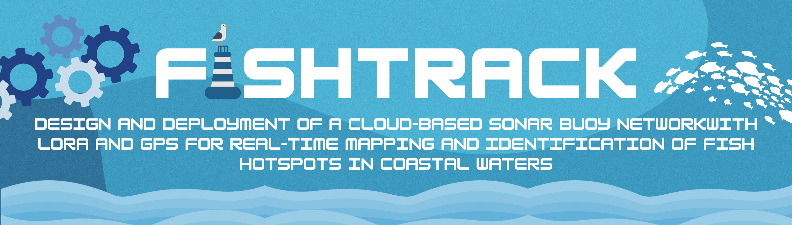
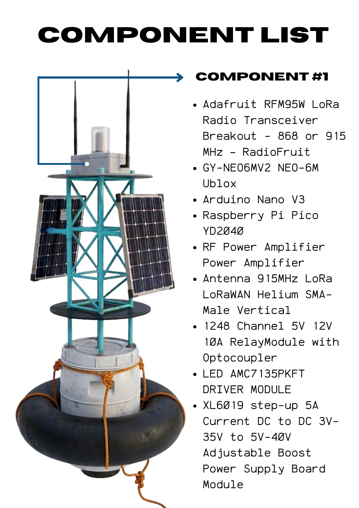
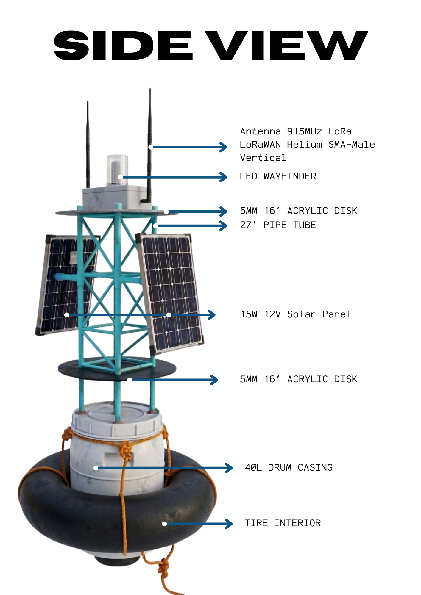
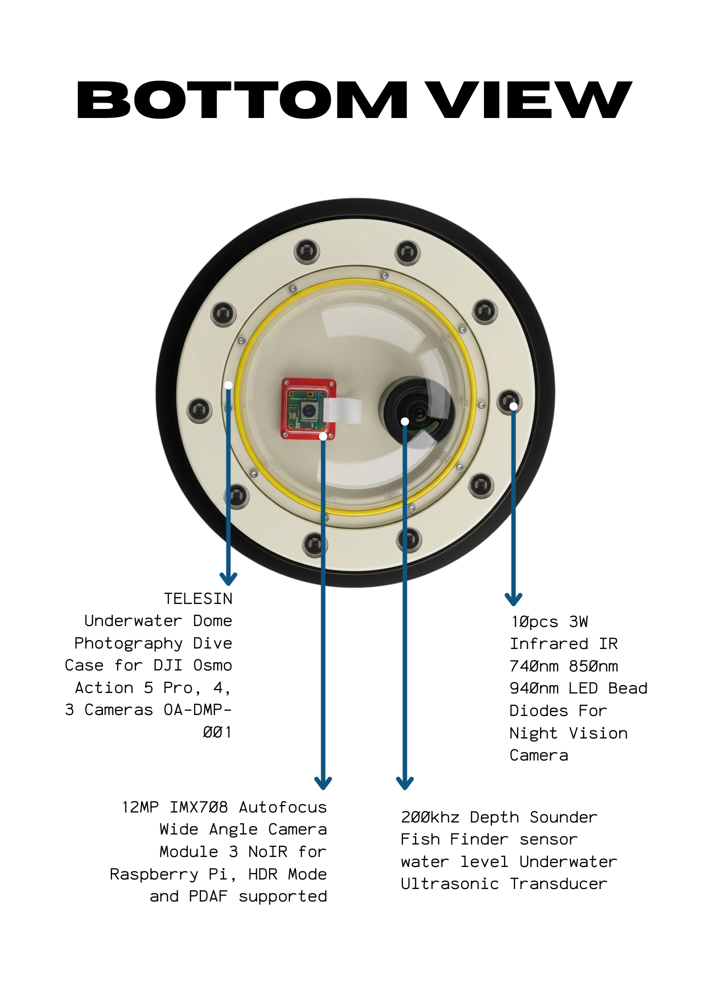
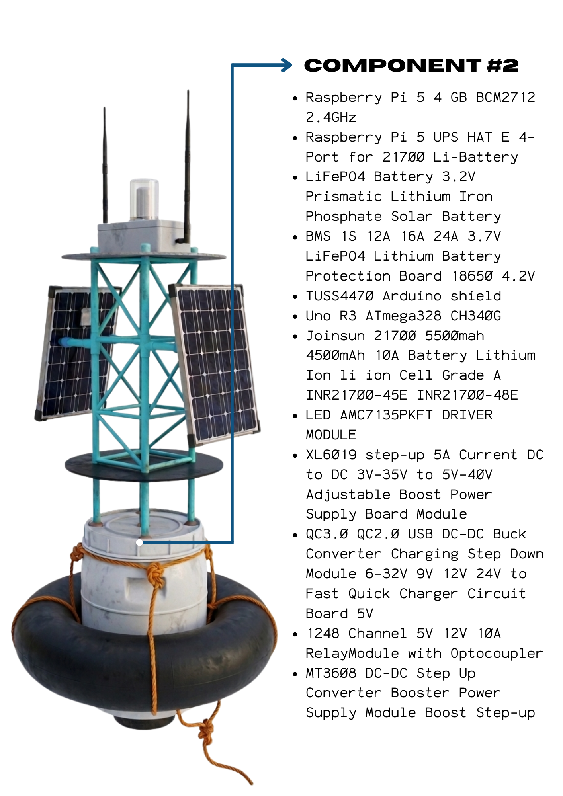
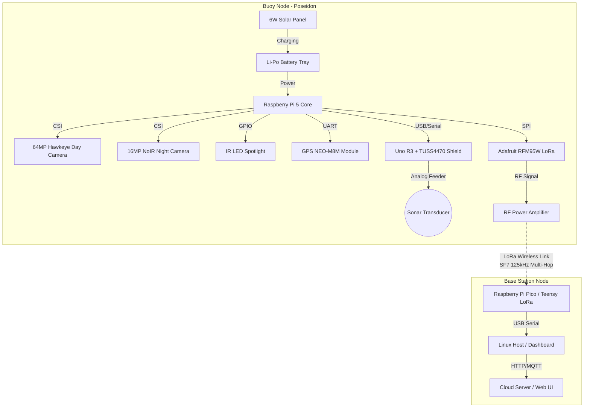
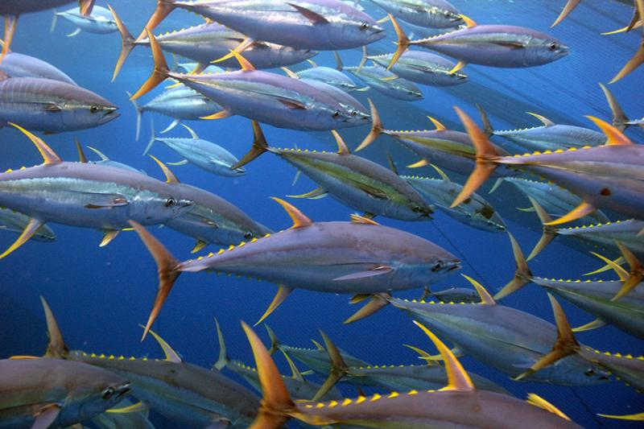

# <p align="center">  </p>

<p align="center">
  
  
  
  
  
  
  
  
</p>

FishTrack is an autonomous marine monitoring system that integrates underwater acoustics (sonar), artificial intelligence (YOLO-based fish detection), satellite navigation (GPS), and low-power long-range communication (LoRa) to dynamically map marine environments. Designed for coastal fishing communities, it aims to reduce manual search time, lower fuel costs, and encourage sustainable fisheries management.

---

## 📸 Product Showcase & Gallery

Below is the physical and component design of the completed FishTrack buoy, demonstrating its waterproof structural assembly, floatation components, and electronic chassis.

### 🌟 The Completed Buoy

| Final Product (Chassis & Flotation) | Component Layout (Internal Assembly) |
| :---: | :---: |
|  |  |
---
| Side Elevation View | Bottom Transducer View | Auxiliary Components |
| :---: | :---: | :---: |
|  |  |  |

## 💡 Rationale & Problem Statement

Traditional coastal fishing is heavily reliant on manual searches, leading to time-consuming and fuel-intensive trips. This guesswork causes:
- **Financial strain** due to unnecessary fuel consumption.
- **Ecological imbalance**, leaving some areas overfished while others remain untouched.
- **Safety hazards** in rough seas when locating hotspots manually.

**FishTrack** addresses these issues by providing a network of solar-powered buoys that detect fish underwater and broadcast hotspots directly to a base station and cloud dashboard without requiring local internet connectivity.

---

## 🛠️ System Architecture



---

## 📋 Bill of Materials (BoM)
A full comparative cost breakdown between the **Completed Buoy Build** (as deployed) and a **Cheap Alternative Build** evaluated during prototype testing. All prices are listed in Philippine Pesos (PHP).

| Material / Component | Completed Build Price (PHP) | Cheap Alternative Price (PHP) | Role & System Fit |
| :--- | :---: | :---: | :--- |
| **Raspberry Pi 5 8GB** | 5,955.00 | 5,955.00 | Main computer; runs AI models & manages logging/queues. |
| **TUSS4470 Arduino Shield Board** | 4,841.47 | 4,841.47 | Sonar analog interface for depth/density. |
| **Adafruit RFM95W Transceiver** | 2,744.00 | 2,744.00 | LoRa transceiver module (2x in Completed; 4x in Cheap Alt). |
| **Arducam for Raspberry Pi Camera** | 2,432.46 | 2,432.46 | Captures high-res day footage for fish detection. |
| **UPS 6th GEN POWER MODULE** | 2,320.00 | 2,320.00 | Battery management, charging circuits, and power delivery. |
| **(2) 915Mhz 4W RF POWER Amplifier** | 2,154.00 | 2,154.00 | Amplifies LoRa RF output signals for multi-mile range. |
| **SMA CONNECTOR + 915MHz Antenna** | 1,738.00 | 1,738.00 | RF antenna connections for LoRa communication. |
| **200KHz Transducer** | 1,555.19 | 1,555.19 | Transmits and receives ultrasonic sonar pulses. |
| **EPOXY Resin CLEAR** | 1,470.00 | 1,470.00 | Waterproof sealant for electronics housing. |
| **TELESIN Underwater Dome Case** | 1,232.00 | 1,232.00 | Underwater enclosure dome for camera optics. |
| **Acrylic Disk 16" 10.5" 10"** | 1,131.00 | 1,131.00 | Structural disk inserts for waterproof sealing. |
| **AMC2170 + PCB MANUFACTURING** | 1,199.00 | 1,199.00 | Custom PCB layout for signal routing and connectors. |
| **GPS - NEO-M8N + 30AWG WIRE** | 1,169.00 | 1,169.00 | GNSS coordinates, speed, and time. |
| **SOLAR PANEL 15W** | 870.00 | 870.00 | Continuous solar charging in marine environments. |
| **10pcs LED Lens w/ Holder** | 956.00 | 956.00 | Focuses wayfinding and IR spotlight illumination. |
| **XL6019 Set-UP 5A Current Dc-DC** | 482.00 | 482.00 | Voltage boosting for high-power modules. |
| **5V RELAY + SOLDER WICK + PCB** | 242.00 | 242.00 | Switching control for auxiliary lights/sensors. |
| **5A DC-DC MPPT Solar Constant V** | 313.00 | 313.00 | MPPT solar battery charging controller. |
| **Cooling Radiator RP 5** | 197.00 | 197.00 | Thermal radiator/fan for Raspberry Pi 5. |
| **Aluminium Water Block Radiator** | 170.00 | 170.00 | Passive liquid/water block for outer cooling. |
| **DRUM 40L (BUOY BODY)** | 621.00 | ~ | Main outer flotation body of the buoy. |
| **120Ah 3.2v Battery LiFePO4** | ~ | 1,700.00 | Larger alternative storage bank. |
| **(4) 21700 5550mAh Battery** | ~ | 900.00 | Lithium battery cells (used in cheap alternative power module). |
| **Arducam Pi Camera (Secondary)** | ~ | 248.00 | Extra secondary night/IR camera. |
| **Arduino Nano V3** | ~ | ~ | Auxiliary microcontroller (CH340G). |
| **Arduino Uno R3 (CH340G)** | ~ | ~ | Sonar echo timing controller. |
| **Raspberry Pi Pico YD-RP2040** | ~ | ~ | Mesh node processing controller. |
| **3W LED Light w/ Heatsink** | ~ | ~ | Wayfinder lighting system. |
| **10pcs 3W Infrared IR 940nm LED** | ~ | ~ | Underwater infrared illumination array. |
| **TOTAL PROJECT COST** | **33,792.12 PHP** | **36,019.12 PHP** | **Completed Build is ~6.2% more cost-effective.** |

---

## ⚙️ Software Flow & Logic

The system runs a modular daemon loop coordinating five files:
1. `config.py`: Core configurations, directory paths, and global stats.
2. `hardware.py`: Encapsulates serial hardware interfaces for LoRa, LEDs, and Battery (I2C).
3. `mesh.py`: Operates packet deduplication, multi-hop routing, and chunk reassembly.
4. `executor.py`: Spawns and monitors camera and sonar subprocesses with resource safety.
5. `main.py`: The entry orchestrator driving the main timer loop.

```
                  ┌──────────────────────────────┐
                  │         main.py              │
                  │   (Central Loop & Event)     │
                  └──────────────┬───────────────┘
                                 │
         ┌───────────────────────┼───────────────────────┐
         ▼                       ▼                       ▼
┌────────────────┐      ┌────────────────┐      ┌────────────────┐
│   hardware.py  │      │    mesh.py     │      │   executor.py  │
│ (LoRa/LED/I2C) │      │ (MeshTelemetry)│      │(Subprocesses)  │
└────────────────┘      └────────────────┘      └────────────────┘
```

### Critical Flow Stages
- **Startup Phase**: Verifies hardware connections. If the Teensy/Pico responds to a `STATUS` query, a green LED blinks on startup for 30s. If it fails, a red LED blinks and the system exits.
- **LoRa Telemetry**: Features explicit half-duplex TX/RX mode switching. The Pico does not queue; the Pi manages packet buffering and waits for transmission confirmation (`OK:SENT`).
- **Packet Chunking**: Larger payloads are compressed (zlib + CBOR2), divided into chunks, base64-encoded, and sent via fire-and-forget loops, reassembling at the receiver using MD5 hashes.
- **Thermal Safety (LEDs)**: High-power LEDs are cycled with thermal timeouts (e.g., 3s active, 12s cooldown) to protect un-heatsinked emitters.

---

## 📊 Experimental Results & Calculations

### 1. GPS Accuracy Evaluation
Coordinates were recorded over a 72-hour period in Marinduque, Philippines, to verify positioning reliability.

| Hour Interval | Recorded UTC Timestamp | Measured Latitude | Measured Longitude | Altitude (m) | Satellites | Status |
| :---: | :--- | :---: | :---: | :---: | :---: | :---: |
| **12 hrs** | `2026-02-17T08:45:59` | 13.482113 | 122.053277 | 10.98 | 9 | Acquired |
| **24 hrs** | `2026-02-18T08:45:59` | 13.482112 | 122.053278 | 10.98 | 9 | Acquired |
| **36 hrs** | `2026-02-18T20:45:59` | 13.482121 | 122.053279 | 10.98 | 9 | Acquired |
| **48 hrs** | `2026-02-19T08:45:59` | 13.482117 | 122.053288 | 9.23 | 10 | Acquired |
| **60 hrs** | `2026-02-19T20:45:59` | 13.482124 | 122.053268 | 10.98 | 9 | Acquired |
| **72 hrs** | `2026-02-20T08:45:59` | 13.482121 | 122.053278 | 9.23 | 10 | Acquired |

### 2. Sonar Depth Calibration (Formula)
Depth error is analyzed across discrete increments (50m, 100m, 150m, 200m) to check transducer calibration:
$$\text{Absolute Error} = D_{\text{measured}} - D_{\text{sonar}}$$
$$\text{Relative Error (\%)} = \frac{D_{\text{measured}} - D_{\text{sonar}}}{D_{\text{measured}}} \times 100$$

### 3. AI Target Identification (Sample Output)
Arducam for Raspberry Pi Camera footage served as the visual ground-truth reference for validating the YOLO detection accuracy.


*Sample detection targets including: Bagre marinus, Tylosurus crocodilus, Caranx hippos, and Anguilla rostrata.*

| Target Image Name | Timestamp | Fish Detected | Top Predicted Species | Confidence | Direct Score | Retrieval Score |
| :--- | :---: | :---: | :--- | :---: | :---: | :---: |
| `19_02_2026_19_55_48.png` | 19:55 | 1 | *Bagre marinus* | 71.53% | 0.6382 | 0.7924 |
| `19_02_2026_08_35_16.png` | 08:35 | 2 | *Tylosurus crocodilus* | 70.70% | 0.6121 | 0.8018 |
| `18_02_2026_08_29_08.png` | 08:29 | 1 | *Caranx hippos* | 64.59% | 0.5496 | 0.7422 |
| `17_02_2026_18_18_28.png` | 18:18 | 2 | *Anguilla rostrata* | 65.05% | 0.5944 | 0.7066 |
| `20_02_2026_07_58_52.png` | 07:58 | 1 | *Salmo salar* | 67.23% | 0.5926 | 0.7519 |

---

## 🚀 Installation & Running

### Dependencies
Before running the daemon, ensure libraries are installed (preferably on a Raspberry Pi OS running Python 3.10+):
```bash
pip install pyserial cbor2 smbus
```

### Running the Controller
Start the main controller loop, specifying the serial port of the LoRa Teensy/Pico and the buoy identifier:
```bash
python main.py --port /dev/ttyACM0 --codename BUOY-POSEIDON
```

For testing or development environments where hardware serial devices are not connected, you can mock imports and call the verification script:
```bash
python scratch/validate_refactoring.py
```

---

## 🔗 References & Open Source Credits

- **SONAR Driver Hardware Interface**: Utilizes principles and configurations from the [Open Echo TUSS4470 Driver](https://github.com/Neumi/open_echo) (cloned locally at [open_echo](file:///c:/Users/EJ/Desktop/FISHTRACK/MACOSX/FISHTRACK-BUOY/open_echo)) to coordinate ultrasonic pulse-echo calculations.
- **AI Fish Species Database**: Incorporates taxonomy classifications and neural network insights from the [Fishial Fish Identification Project](https://github.com/fishial/fish-identification) (cloned locally at [fish-identification](file:///c:/Users/EJ/Desktop/FISHTRACK/MACOSX/FISHTRACK-BUOY/fish-identification)) to validate target predictions.

## 💖 Donate & Support

If you find this project useful and would like to support the deployment of FishTrack buoys for coastal fishing communities, donations are greatly appreciated!

<p align="left">
  <a href="bitcoin:13zWnp2ty3NPzAXX9QxwEeoPSKhN5tPzic">
    
  </a>
</p>

**Bitcoin Address:** `13zWnp2ty3NPzAXX9QxwEeoPSKhN5tPzic`
