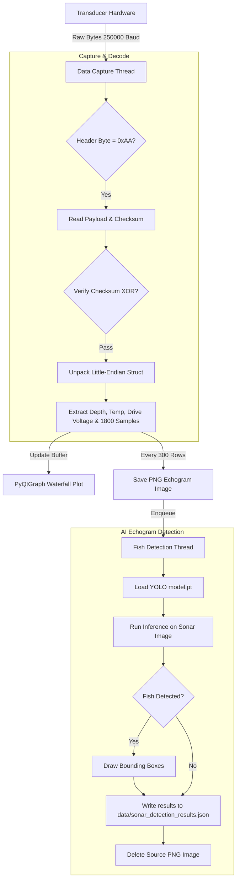

# 🔊 Sonar Data Processing & Echogram Visualization

<p align="center">
  
  
  
</p>

## 📌 Overview

The **Sonar Data Subsystem** processes underwater acoustic reflections to map the seabed, thermoclines, and fish schools. It interfaces with an Arduino Uno R3 or Teensy equipped with a **TUSS4470** ultrasonic shield. The host software decodes high-speed serial streams, plots real-time waterfall echograms, runs **YOLO** on echogram snapshots to detect fish patterns, and serves NMEA telemetry over TCP.

---

## ⚙️ How It Works & Processing Pipeline

The module runs two concurrent data-processing threads:



### 1. Packet Decoding Scheme
The serial receiver expects structured binary frames sent by the microcontroller at `250000 Baud`:

```text
+------+---------+-------------+-------------+-----------------------+----------+
| 0xAA | Depth   | Temp        | Vdrv        | 1800 Envelope Samples | Checksum |
| (1B) | (2B LE) | (2B Signed) | (2B Unsign) | (1800 Bytes)          | (1B XOR) |
+------+---------+-------------+-------------+-----------------------+----------+
```

### 2. Depth Calculation Formula
The depth represented by each sample index is calculated based on the Speed of Sound in water and the ADC sampling interval:

$$D_i = \frac{v_{\text{sound}} \times t_{\text{sample}} \times i}{2}$$

Where:
*   \(v_{\text{sound}}\) is the speed of sound in water (\(1500 \text{ m/s}\) / \(150000 \text{ cm/s}\)) or air (\(330 \text{ m/s}\)).
*   \(t_{\text{sample}}\) is the sample resolution time (\(13.2 \ \mu\text{s}\) for ATmega328 ADCs).
*   \(i\) is the sample index (\(0 \le i < 1800\)).

For water, this yields:

$$\text{Resolution} = \frac{150000 \times 13.2 \times 10^{-6}}{2} \approx 0.99 \text{ cm per sample}$$

$$\text{Max Range} = 1800 \times 0.99 \approx 1782 \text{ cm } (17.82 \text{ meters})$$

### 3. AI Echogram Detection
Instead of running object detection directly on 1D raw waveforms, the system groups 300 consecutive readings into a 2D echogram image matrix, writes it as a grayscale PNG, and runs YOLO object detection. This identifies the hyperbola-like shapes characteristic of moving fish.

---

## 📂 Source Code Map
*   **[echo_interface.py](file:///c:/Users/Ervin%20Regio/Desktop/MACOSX/FISHTRACK-BUOY/SONAR_DATA/echo_interface.py)**: Main PyQt5 visualization, packet parser, and YOLO detection script.
*   **model.pt**: Pre-trained YOLO model for echogram shape identification.

---

## 🚀 Execution & Command Reference

Ensure dependencies are installed:
```bash
pip install pyqt5 pyqtgraph qdarktheme opencv-python ultralytics
```

Run the GUI tool:
```bash
python SONAR_DATA/echo_interface.py
```

To run in **Headless mode** (saving echogram frames in the background without launching the GUI):
```bash
python SONAR_DATA/echo_interface.py --headless
```
