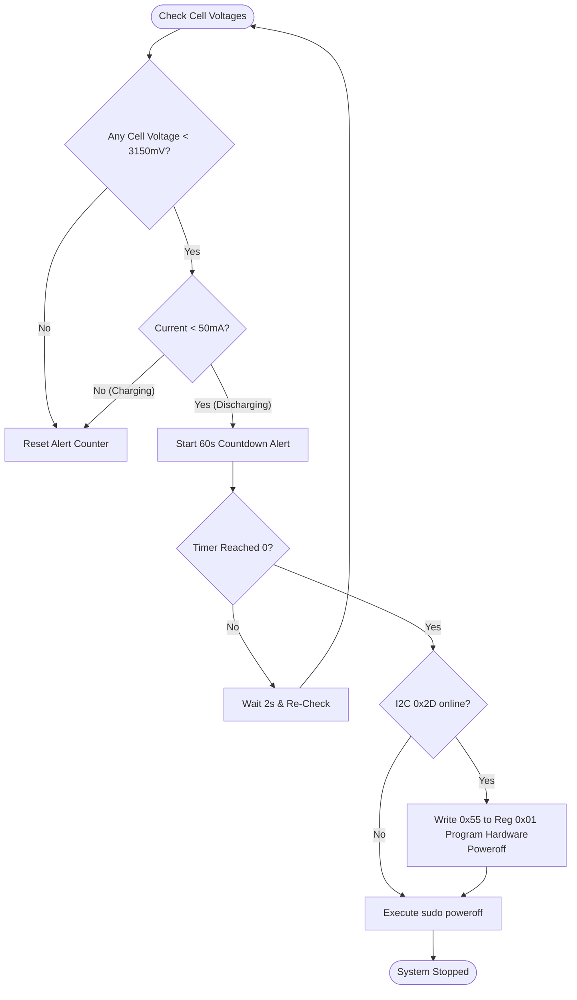

# 🔋 UPS HAT E - Power Telemetry & Safety Daemon

<p align="center">
  
  
  
</p>

## 📌 Overview

The **UPS HAT E Subsystem** manages power telemetry and battery safety on the buoy. It communicates with a Waveshare 6th Gen Power Module via the **I2C interface** at address `0x2d`. The module continuously tracks input VBUS charging power, battery capacity percentages, individual cell voltages, and runs an emergency shutdown daemon to protect the battery cells from deep-discharge damage.

---

## ⚙️ I2C Registry Mapping & telemetry

The daemon queries several registers on I2C bus `1` at address `0x2d` to retrieve battery analytics:

### 1. Operation State Registry (`0x02`)
Reads operational states from bits:
*   `data[0] & 0x40`: Fast Charging state
*   `data[0] & 0x80`: Charging state
*   `data[0] & 0x20`: Discharging state
*   Otherwise: Idle state

### 2. VBUS Metric Registry (`0x10`)
Reads 6 bytes of input line power data:
*   **Voltage (mV)**: `data[0] | data[1] << 8`
*   **Current (mA)**: `data[2] | data[3] << 8`
*   **Power (mW)**: `data[4] | data[5] << 8`

### 3. Battery Metric Registry (`0x20`)
Reads 12 bytes of cell pack parameters:
*   **Voltage (mV)**: `data[0] | data[1] << 8`
*   **Current (mA)**: `data[2] | data[3] << 8` (converted to a signed value: if `> 0x7FFF`, subtract `0xFFFF`).
*   **Capacity (%)**: `data[4] | data[5] << 8`
*   **Remaining Capacity (mAh)**: `data[6] | data[7] << 8`

### 4. Cell Balancing Registry (`0x30`)
Reads 8 bytes of individual cell voltages:
*   **Cell 1**: `data[0] | data[1] << 8`
*   **Cell 2**: `data[2] | data[3] << 8`
*   **Cell 3**: `data[4] | data[5] << 8`
*   **Cell 4**: `data[6] | data[7] << 8`

---

## 🛡️ Emergency Shutdown Hysteresis

To prevent permanent damage to the Lithium battery cells, the system executes an automated safe-poweroff sequence:



> [!CAUTION]
> Deep discharging lithium cells below \(3.0\text{V}\) degrades capacity and can cause cells to fail. The daemon monitors the cell voltages at \(3.15\text{V}\) to ensure a safe shutdown window.
> The register write `i2cset -y 1 0x2d 0x01 0x55` tells the UPS hardware to cut its own output power lines 60 seconds after the Pi shuts down. When solar power returns and charging resumes, the UPS will re-enable the power rails and boot up the Pi automatically.

---

## 📂 Source Code Map
*   **[ups.py](file:///c:/Users/Ervin%20Regio/Desktop/MACOSX/FISHTRACK-BUOY/UPS_HAT_E/ups.py)**: Low-level terminal daemon.
*   **[batteryTray.py](file:///c:/Users/Ervin%20Regio/Desktop/MACOSX/FISHTRACK-BUOY/UPS_HAT_E/batteryTray.py)**: PyQt5 desktop system tray application.
*   **battery.desktop**: Autostart desktop shortcut.
*   **[main.sh](file:///c:/Users/Ervin%20Regio/Desktop/MACOSX/FISHTRACK-BUOY/UPS_HAT_E/main.sh)**: Autostart installer script.
*   **images/**: Resource folder containing battery percentage and charging icons.

---

## 🚀 Installation & Setup

Configure autostart on Raspberry Pi:
```bash
chmod +x UPS_HAT_E/main.sh
./UPS_HAT_E/main.sh
```

This installs the tray utility to run automatically on desktop launch.
To run the terminal monitor daemon manually:
```bash
python UPS_HAT_E/ups.py
```
